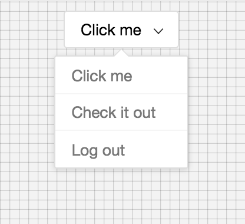
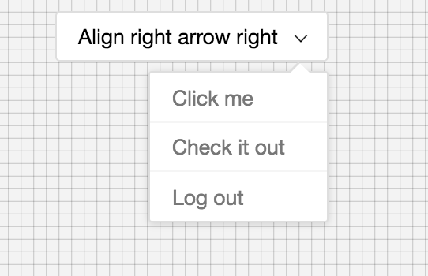
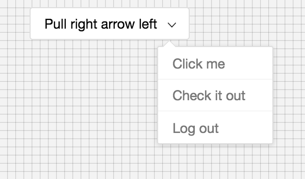

# React Dropdown [](https://badge.fury.io/js/%40tgdn%2Freact-dropdown)

An accessible, easy to use, customizable dropdown library for the web.

Ongoing work on the library.






## Playground
To run demo on your computer

-     npm install
-     npm run storybook
- visit http://localhost:9001/


## Installing
```
npm install --save @tgdn/react-dropdown
```

## Usage
```
import React from 'react'
import {
    Dropdown,
    DropdownMenu,
    DropdownMenuItem,
    DropdownButton
} from '@tgdn/react-dropdown'

const MyMenu = props => {
    return (
        <DropdownButton title='Click me' center>
            <DropdownMenu>
                <DropdownMenuItem>Click me</DropdownMenuItem>
				<DropdownMenuItem>Once more</DropdownMenuItem>
                <DropdownMenuItem>Log out</DropdownMenuItem>
            </DropdownMenu>
        </DropdownButton>
    )
}
```

## Done
- Simple UI
- Reactive Component
- Dropdown positioning
- Arrow positioning
- Dropdown Button and Menu

## To do
- Dynamic positioning on window scroll and window resize
- More components (simple view, ...)
